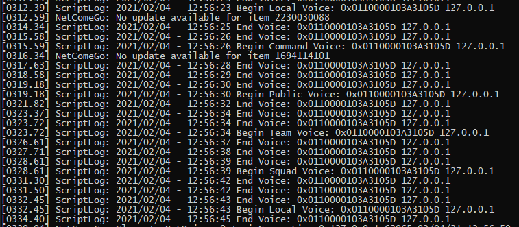

# VOIP Logging Mutator for Rising Storm 2: Vietnam

Adds log entries to server log when players start and stop broadcasting in voice chat.

Add to server startup line to enable: `?mutator=VOIPLoggingMutator.VOIPLoggingMutator`

Example log entries:

